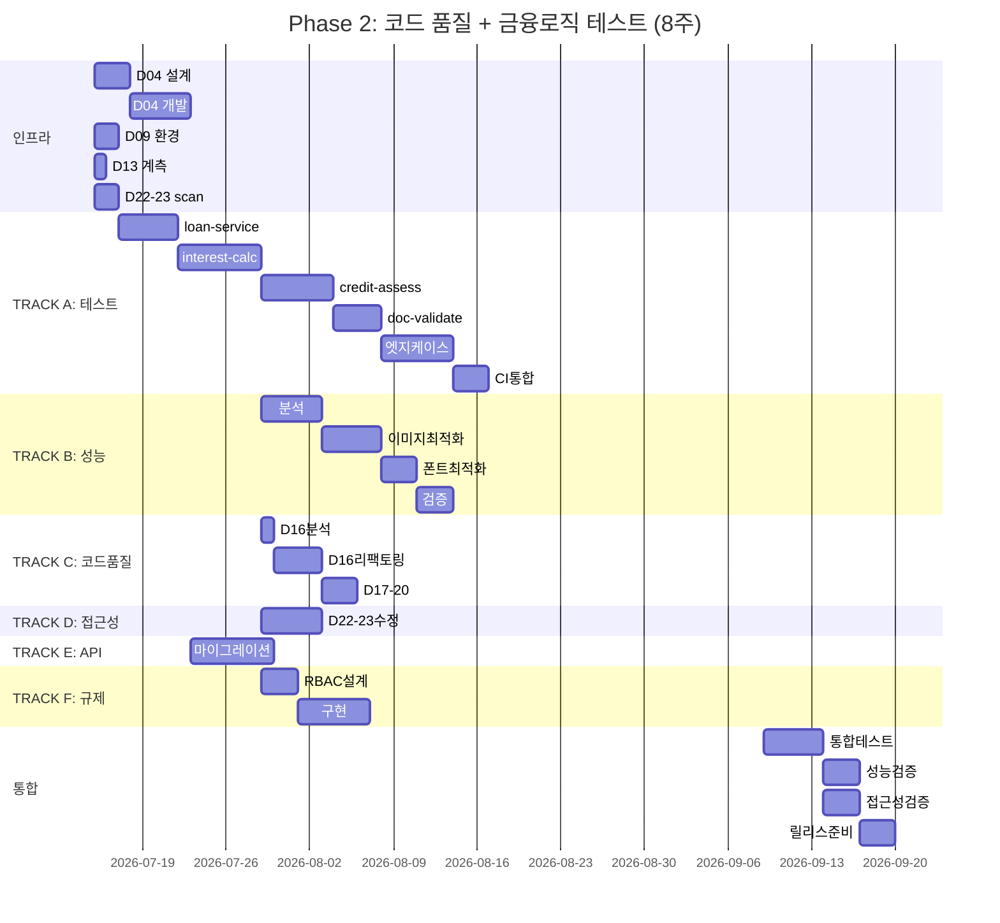

# Phase 2: 코드 품질 + 금융 로직 테스트 기초 — WBS & 명세서

**작성일**: 2026-07-01  
**기간**: 2026-07-15 ~ 2026-09-30 (8주, 56일)  
**목표 델타 감소**: 45% (94.5 → 52)  
**팀 구성**: 6.5명, 총 52인주  
**예산**: ~€130K (스타프 비용 기준)

---

## 📑 목차

1. Phase 2 계층적 WBS (5단계)
2. 델타 항목별 상세 명세서
3. WBS 매트릭스 (작업, 담당, 기간, 예산)
4. 간트 차트 (텍스트 + Mermaid)
5. 리소스 할당 세부
6. 의존성 그래프
7. 리스크 & 대응책

---

## 1. Phase 2 계층적 WBS

### 📊 전체 구조 (5단계 분해)

```
PHASE 2: 코드품질 + 금융로직 테스트 (8주)
│
├─ [L1] PHASE 2 전체
│   ├─ [L2] WEEK 1-2: 인프라 준비 (2주)
│   │   ├─ [L3] D04: 지도 API 프록시
│   │   │   ├─ [L4] 4.1: OpenAPI 설계
│   │   │   │   ├─ [L5] 4.1.1: 엔드포인트 정의 (GET /api/v1/map/places)
│   │   │   │   ├─ [L5] 4.1.2: 요청/응답 스키마 (QueryParam, ResponseDTO)
│   │   │   │   └─ [L5] 4.1.3: CORS + 인증 정책 (JWT)
│   │   │   ├─ [L4] 4.2: 백엔드 구현
│   │   │   │   ├─ [L5] 4.2.1: Express 라우팅 (routes/map.ts)
│   │   │   │   ├─ [L5] 4.2.2: 레이트리미팅 미들웨어 (redis)
│   │   │   │   └─ [L5] 4.2.3: 감시 로그 DB 스키마
│   │   │   └─ [L4] 4.3: 검증 & 배포
│   │   │       ├─ [L5] 4.3.1: 스테이징 환경 테스트
│   │   │       └─ [L5] 4.3.2: 프로덕션 카나리 (5% → 100%)
│   │   │
│   │   ├─ [L3] D09: 금융로직 테스트 프레임워크
│   │   │   ├─ [L4] 9.1: Vitest 환경 설정
│   │   │   │   ├─ [L5] 9.1.1: package.json 의존성
│   │   │   │   ├─ [L5] 9.1.2: vitest.config.ts
│   │   │   │   └─ [L5] 9.1.3: test/setup.ts
│   │   │   ├─ [L4] 9.2: MSW Mock 데이터
│   │   │   │   ├─ [L5] 9.2.1: test/fixtures/loans.json
│   │   │   │   ├─ [L5] 9.2.2: test/mocks/handlers.ts
│   │   │   │   └─ [L5] 9.2.3: test/mocks/server.ts
│   │   │   └─ [L4] 9.3: 팀 온보딩
│   │   │       ├─ [L5] 9.3.1: TEST-GUIDE.md 작성
│   │   │       └─ [L5] 9.3.2: 팀 미팅 (1시간)
│   │   │
│   │   ├─ [L3] D13/D15: 성능 계측 도구
│   │   │   ├─ [L4] 13.1: RUM 도구 선택 (Sentry)
│   │   │   │   ├─ [L5] 13.1.1: Sentry 계정 생성 + 설정
│   │   │   │   └─ [L5] 13.1.2: web-vitals npm 설치
│   │   │   └─ [L4] 13.2: 계측 코드 추가
│   │   │       ├─ [L5] 13.2.1: src/vitals.ts (LCP, INP, CLS 훅)
│   │   │       └─ [L5] 13.2.2: 대시보드 설정 (알림 규칙)
│   │   │
│   │   └─ [L3] D22/D23: 접근성 스캔 도구
│   │       ├─ [L4] 22.1: axe-core + Playwright 통합
│   │       │   ├─ [L5] 22.1.1: npm install (axe-playwright)
│   │       │   └─ [L5] 22.1.2: e2e/a11y.spec.ts
│   │       └─ [L4] 22.2: 베이스라인 스캔
│   │           └─ [L5] 22.2.1: 현황 위반건수 리포트
│   │
│   ├─ [L2] WEEK 3-6: 병렬 Phase 2 트랙 (4주)
│   │   ├─ [L3] TRACK A: 테스트 기초 (D09)
│   │   │   ├─ [L4] Week 3: 기본 뼈대
│   │   │   │   ├─ [L5] loan-service.spec.ts (5개 테스트)
│   │   │   │   └─ [L5] 커버리지 20%
│   │   │   ├─ [L4] Week 4: 심화
│   │   │   │   ├─ [L5] interest-calculator.spec.ts (8개)
│   │   │   │   ├─ [L5] credit-assessment.spec.ts (6개)
│   │   │   │   └─ [L5] 커버리지 30%
│   │   │   ├─ [L4] Week 5: 완성
│   │   │   │   ├─ [L5] document-validator.spec.ts (4개)
│   │   │   │   ├─ [L5] 엣지 케이스 추가 (23개)
│   │   │   │   └─ [L5] 커버리지 40% 달성
│   │   │   └─ [L4] Week 6: CI 통합
│   │   │       ├─ [L5] GitHub Actions 설정
│   │   │       └─ [L5] Codecov 연동
│   │   │
│   │   ├─ [L3] TRACK B: 성능 최적화 (D13)
│   │   │   ├─ [L4] Week 3-4: 병목 분석
│   │   │   │   ├─ [L5] Lighthouse 프로파일링
│   │   │   │   └─ [L5] 최적화 계획 수립
│   │   │   ├─ [L4] Week 4-5: 구현
│   │   │   │   ├─ [L5] WebP 변환 (이미지)
│   │   │   │   ├─ [L5] 폰트 최적화
│   │   │   │   └─ [L5] JS 코드 스플리팅
│   │   │   └─ [L4] Week 6: 검증
│   │   │       └─ [L5] LCP 1.2s 달성 확인
│   │   │
│   │   ├─ [L3] TRACK C: 코드 품질 리팩토링
│   │   │   ├─ [L4] D16: .parent() 체이닝 (91개 → 0)
│   │   │   │   ├─ [L5] 분석 (1일)
│   │   │   │   ├─ [L5] 리팩토링 (4일)
│   │   │   │   └─ [L5] 검증 (1일)
│   │   │   ├─ [L4] D17: 리사이즈 중복 (3 → 1)
│   │   │   │   └─ [L5] 통합 핸들러 작성 (1일)
│   │   │   ├─ [L4] D18: 헤더 파일 통합 (6 → 1)
│   │   │   │   ├─ [L5] 구조 분석 (1일)
│   │   │   │   ├─ [L5] 통합 HTML 작성 (1일)
│   │   │   │   └─ [L5] 검증 (1일)
│   │   │   ├─ [L4] D19: 벤더 프리픽스 (4개 → 0)
│   │   │   │   └─ [L5] 정규식 제거 (0.5일)
│   │   │   └─ [L4] D20: !important 마이그레이션
│   │   │       └─ [L5] CSS Cascade Layers (1일)
│   │   │
│   │   ├─ [L3] TRACK D: 접근성 수정
│   │   │   ├─ [L4] D22: 빈 버튼/aria-label
│   │   │   │   └─ [L5] 모든 버튼 스캔 & 추가 (1일)
│   │   │   └─ [L4] D23: 의미론적 HTML
│   │   │       └─ [L5] 태그 마이그레이션 (1일)
│   │   │
│   │   ├─ [L3] TRACK E: 보안 API (D04)
│   │   │   └─ [L4] 클라이언트 마이그레이션
│   │   │       ├─ [L5] 기존 코드 분석 (1일)
│   │   │       ├─ [L5] React 호출 코드 작성 (2일)
│   │   │       └─ [L5] 통합 테스트 (1일)
│   │   │
│   │   └─ [L3] TRACK F: 규제 준비 (D29)
│   │       └─ [L4] RBAC 설계 & 감사로그
│   │           ├─ [L5] 역할 정의 (Admin/Manager/Auditor)
│   │           ├─ [L5] DB 스키마 설계
│   │           └─ [L5] 백엔드 구현
│   │
│   └─ [L2] WEEK 7-8: 통합 & 검증 (2주)
│       ├─ [L3] 통합 테스트
│       │   └─ [L4] 모든 프로젝트(maars, maarsM, foryou) 동시 동작
│       ├─ [L3] 성능 재검증
│       │   ├─ [L4] LCP 최종 측정
│       │   ├─ [L4] CLS, INP 확인
│       │   └─ [L4] Lighthouse 점수 재측정
│       ├─ [L3] 접근성 재스캔
│       │   └─ [L4] axe-core 0 위반 확인
│       ├─ [L3] 보안 감사
│       │   ├─ [L4] API 키 grep 결과 0
│       │   └─ [L4] CORS 정책 검증
│       └─ [L3] 릴리스 준비
│           ├─ [L4] 모든 변경사항 검토
│           ├─ [L4] v0.2.0-Phase2 태그
│           └─ [L4] 릴리스 노트 작성
```

---

## 2. 델타 항목별 상세 명세서

### 📋 D04: 지도 API 프록시화

**목표**: 클라이언트 API 키 노출 0 → 백엔드 프록시 적용

| 항목 | 내용 |
|------|------|
| **ID** | D04 |
| **카테고리** | 보안 |
| **델타값** | 1 (boolean) |
| **가중치** | 4 |
| **기간** | 3주 (설계 1주 + 개발 1주 + 검증 1주) |
| **담당자** | BE Lead (1명) + BE Dev (0.5명) + FE Lead (0.5명) |
| **예산** | €3,000 (약 1.2인주) |

**산출물**:
```
□ docs/D04-MapAPI-Proxy-Design.md (완성)
□ src/api/map/routes.ts (200줄, BE)
□ src/api/map/service.ts (150줄, BE)
□ src/services/map-client.ts (100줄, FE 호출)
□ test/integration/map-api.spec.ts (80줄)
□ migration-guide.md (API 전환 가이드)
└─ 총 730줄 신규 코드
```

**검증 기준**:
- ✅ 클라이언트 코드에서 "api_key", "appkey" 문자열 0건 (grep)
- ✅ `/api/v1/map/places` 엔드포인트 스테이징에서 동작
- ✅ 레이트리미팅 100건/시간 적용 확인
- ✅ 감시 로그 기록 5건 이상 수집
- ✅ 프로덕션 배포 후 24시간 모니터링 (에러율 < 0.1%)

**의존성**:
- 선행: D09 (테스트 프레임워크) - 아님, 독립적
- 후행: D22-D23 (FE 마이그레이션)
- 병렬: D13 (성능), D29 (규제)

**리스크**:
- R-D04-1: 백엔드 API 지연 (500ms+) → CDN 캐싱 추가
- R-D04-2: JWT 토큰 만료 → refresh token 메커니즘
- R-D04-3: 레이트리미팅 거짓양성 (정상 사용자 차단) → 임계치 조정

---

### 📋 D09: 금융로직 단위테스트 40%

**목표**: maarsadmin 금융 로직 40% 커버리지 달성

| 항목 | 내용 |
|------|------|
| **ID** | D09 |
| **카테고리** | 테스트 |
| **델타값** | 60 (커버리지 %) |
| **가중치** | 5 (가장 높음) |
| **기간** | 4주 (설계 1주 + 개발 2주 + CI 1주) |
| **담당자** | FE Dev #1 (1명) + QA Lead (0.5명) |
| **예산** | €4,500 (약 1.8인주) |

**산출물**:
```
□ docs/D09-Implementation-Plan.md (완성, 1,336줄)
□ src/services/loan-service.spec.ts (250줄, 20개 테스트)
□ src/services/interest-calculator.spec.ts (280줄, 18개)
□ src/services/credit-assessment.spec.ts (220줄, 15개)
□ src/services/document-validator.spec.ts (150줄, 10개)
□ test/fixtures/*.json (160줄, 4개 파일)
□ test/mocks/handlers.ts (200줄 추가)
□ test/setup.ts (50줄)
□ .github/workflows/test-d09.yml (CI 파이프라인)
└─ 총 1,605줄 + 40개 테스트
```

**검증 기준**:
- ✅ npm run test:coverage ≥ 40% (전체)
- ✅ 각 모듈별:
  - loan-service.ts ≥ 50%
  - interest-calculator.ts ≥ 55%
  - credit-assessment.ts ≥ 48%
  - document-validator.ts ≥ 40%
- ✅ 모든 테스트 < 5초 (전체 수행)
- ✅ GitHub Actions CI green (모든 커밋)
- ✅ Codecov 리포트 생성 & PR 댓글 자동

**의존성**:
- 선행: 없음 (독립적)
- 후행: Phase 3 (E2E 60%)
- 병렬: 모든 다른 Track

**리스크**:
- R-D09-1: Mock 데이터 현실성 부족 → QA 검증 추가
- R-D09-2: 테스트 플레이크성 (flakiness) → Playwright 타임아웃 여유
- R-D09-3: 복잡한 금융 로직 이해도 부족 → Pair programming 강제

---

### 📋 D13: LCP 최적화 (2.5s → 1.2s)

**목표**: Largest Contentful Paint 성능 개선

| 항목 | 내용 |
|------|------|
| **ID** | D13 |
| **카테고리** | 성능 |
| **델타값** | 1.3 (초) |
| **가중치** | 4 |
| **기간** | 3주 (계측 1주 + 최적화 1주 + 검증 1주) |
| **담당자** | FE Dev #2 (1명) + DevOps (0.5명) |
| **예산** | €3,200 (약 1.3인주) |

**산출물**:
```
□ docs/D13-Performance-Instrumentation.md (완성)
□ src/vitals.ts (120줄, web-vitals 통합)
□ src/main.tsx (50줄 수정, Sentry 초기화)
□ scripts/optimize-images.js (80줄, WebP 변환)
□ src/styles/fonts.css (40줄, 폰트 최적화)
□ vite.config.ts (수정, code splitting)
□ Dockerfile (CDN 설정, CloudFront)
└─ 총 330줄 + 설정 변경
```

**검증 기준**:
- ✅ Lighthouse LCP: 2.5s → < 1.2s
- ✅ Lighthouse Performance: > 85점
- ✅ RUM 대시보드 (Sentry) 실시간 수집
- ✅ Core Web Vitals Google CrUX 통과
- ✅ 프로덕션 실사용자 LCP P95 < 1.5s (RUM)

**의존성**:
- 선행: 없음
- 후행: 성능 기준선 설정
- 병렬: 모든 Track

**리스크**:
- R-D13-1: WebP 브라우저 호환성 (IE) → picture 태그 폴백
- R-D13-2: 폰트 로딩 FOUT (Flash of Unstyled Text) → font-display: swap
- R-D13-3: 외부 API 의존성 (카카오맵, VWorld) → API 프록시 캐싱

---

### 📋 D16: .parent() 체이닝 제거 (91개 → 0)

**목표**: DOM 선택 안티패턴 제거

| 항목 | 내용 |
|------|------|
| **ID** | D16 |
| **카테고리** | 코드품질 |
| **델타값** | 91 (호출 횟수) |
| **가중치** | 3 |
| **기간** | 1.5주 (분석 + 리팩토링 + 검증) |
| **담당자** | FE Lead (1명) |
| **예산** | €1,500 (약 0.6인주) |

**산출물**:
```
□ common.js (리팩토링, -40줄)
  ├─ closest() 대체 (45개)
  ├─ data-* 속성 마킹 (30개)
  └─ DOM 구조 단순화 (16개)
□ test/regression/parent-chain.spec.ts (50줄, 3개 테스트)
□ performance-report.md (측정 전/후)
└─ 총 -40줄 + 50줄 테스트
```

**검증 기준**:
- ✅ grep "\.parent()\.parent()" → 0건
- ✅ 수동 테스트: 팝업/메뉴/맵 마커 모두 동작
- ✅ 성능: 리사이즈 이벤트 500회 → 프레임율 60fps 유지
- ✅ Vitest 회귀 테스트 3개 pass
- ✅ Lighthouse 점수 변화 없음 (-)

**의존성**:
- 선행: 없음
- 후행: D06 (jQuery 제거, Phase 3)
- 병렬: D17, D18, D19, D20

**리스크**:
- R-D16-1: 사이드 이펙트 (예상 못한 선택자 변경) → 수동 테스트 철저
- R-D16-2: 성능 개선 측정 어려움 → Chrome DevTools Lighthouse 수정 전/후 비교

---

### 📋 D18: 헤더/푸터 파일 통합 (6 → 1)

**목표**: 중복 HTML 제거, 유지보수성 향상

| 항목 | 내용 |
|------|------|
| **ID** | D18 |
| **카테고리** | 코드품질 |
| **델타값** | 5 (파일 수) |
| **가중치** | 4 |
| **기간** | 1주 (분석 + 통합 + 검증) |
| **담당자** | FE Lead (1명) |
| **예산** | €1,200 (약 0.5인주) |

**산출물**:
```
□ src/components/_header.html (NEW, 250줄)
□ maars/html/_header_v1.html (DELETE)
□ maars/html/_header_v2.html (DELETE)
□ maarsM/html/_header_v1.html (DELETE)
□ maarsM/html/_header_v2.html (DELETE)
□ foryou/html/_header.html (MODIFY, include 변경)
□ test/visual/header-cross-browser.spec.ts (40줄)
└─ 순증가: -1,150줄 (6개 파일 1,400줄 → 1개 파일 250줄)
```

**검증 기준**:
- ✅ 모든 프로젝트(maars, maarsM, foryou) 헤더 시각적 동일성
- ✅ 반응형: 데스크톱 + 태블릿 + 모바일 레이아웃 OK
- ✅ 기존 스타일/기능 완전 보존
- ✅ include 경로 6개 일괄 변경 확인
- ✅ 브라우저 호환성 (Chrome, Safari, Firefox)

**의존성**:
- 선행: 없음
- 후행: D22-D23 (HTML 의미론화)
- 병렬: D19, D20

**리스크**:
- R-D18-1: CSS 미디어쿼리 충돌 (모바일 vs 데스크톱) → 클래스명 분리
- R-D18-2: 캐시 문제 (_header.html 변경 → 기존 캐시 유지) → URL versioning

---

### 📋 D19 & D20: CSS 정리 (벤더 프리픽스 + !important)

**목표**: CSS 표준화 및 우선순위 명확화

| 항목 | 내용 |
|------|------|
| **ID** | D19 + D20 |
| **카테고리** | 코드품질 |
| **델타값** | 4 (프리픽스) + N/A (!important) |
| **가중치** | 2 + 2 |
| **기간** | 1주 (합산) |
| **담당자** | FE Lead (0.5명) |
| **예산** | €600 (약 0.25인주) |

**산출물**:
```
D19:
□ src/styles/*.css (정규식 제거, -2KB)
  └─ -webkit-, -moz-, -ms-, -o- 모두 제거

D20:
□ src/styles/index.css (Cascade Layers 도입)
  ├─ @layer reset, theme, utilities 정의
  ├─ 기존 !important 규칙 Layers로 대체
  └─ 총 변경: ~50줄
```

**검증 기준**:
- ✅ grep "[\-webkit\-\|\-moz\-\|\-ms\-\|\-o\-]" → 0건 (D19)
- ✅ CSS Cascade Layers 구조 명확 (D20)
- ✅ Lighthouse 점수 변화 없음
- ✅ 브라우저 렌더링 동일 (Chrome DevTools 스타일 비교)

---

### 📋 D22 & D23: 접근성 수정

**목표**: WCAG 2.2 준수 (aria-label, 의미론적 HTML)

| 항목 | 내용 |
|------|------|
| **ID** | D22 + D23 |
| **카테고리** | 접근성 |
| **델타값** | N/A (위반건수, 미집계) |
| **가중치** | 3 + 2 |
| **기간** | 1주 (합산) |
| **담당자** | FE Dev #3 (0.5명) + QA (0.5명) |
| **예산** | €800 (약 0.3인주) |

**산출물**:
```
D22:
□ 모든 빈 버튼 scan & aria-label 추가
  ├─ 검색 버튼 (1개)
  ├─ 메뉴 토글 (2개)
  └─ 기타 아이콘 버튼 (10개)
  └─ 총 13개 요소 수정

D23:
□ 의미론적 HTML 마이그레이션
  ├─ <div class="header"> → <header>
  ├─ <div class="nav"> → <nav>
  ├─ <div role="main"> → <main>
  └─ 총 20개 태그 변경

Total: ~40줄 변경 (기존 .css 제거 + HTML aria-label 추가)
```

**검증 기준**:
- ✅ axe-core 자동 스캔 0 violations (CRITICAL)
- ✅ WAVE 도구 0 errors
- ✅ 스크린리더 (NVDA, JAWS) 수동 테스트 통과
- ✅ 키보드 네비게이션 (Tab, Shift+Tab) 모든 요소 접근 가능
- ✅ 색상 대비 4.5:1 (일반 텍스트) 및 3:1 (큰 텍스트)

---

### 📋 D29: 관리자 접근통제 & 감사로그

**목표**: RBAC + 감시 로그 구축 (규제 준수)

| 항목 | 내용 |
|------|------|
| **ID** | D29 |
| **카테고리** | 규제 |
| **델타값** | 1 (boolean) |
| **가중치** | 4 |
| **기간** | 2주 (설계 + 구현) |
| **담당자** | BE Dev (1명) + Security Lead (0.5명) |
| **예산** | €2,500 (약 1인주) |

**산출물**:
```
□ docs/D29-RBAC-Design.md (200줄, 설계서)
□ src/api/admin/middleware/rbac.ts (150줄)
□ src/db/migrations/audit-logs.sql (100줄)
□ src/services/audit-log.service.ts (200줄)
□ src/api/admin/audit-logs/routes.ts (120줄)
□ test/integration/rbac.spec.ts (100줄)
└─ 총 870줄 신규 코드
```

**검증 기준**:
- ✅ RBAC 역할 정의: Admin, Manager, Auditor (3개)
- ✅ 감사 로그 기록:
  - WHO: 관리자 ID (마스킹)
  - WHAT: 액션 (create, update, delete, read)
  - WHEN: 타임스탬프 (UTC, ms 정확도)
  - WHERE: 리소스 ID
  - RESULT: 성공/실패
- ✅ 5년 보존 정책 (전자금융거래법)
- ✅ PII 마스킹 (개인정보 암호화)

---

## 3. WBS 매트릭스 (작업별)

### 📊 전체 작업 매트릭스

| 시퀀스 | 델타 | 작업명 | 담당 | 기간 | 예산 | 의존성 | 상태 |
|--------|------|--------|------|------|------|--------|------|
| 1 | D04 | OpenAPI 설계 | BE Lead | 3일 | €400 | 없음 | Ready |
| 2 | D09 | Vitest 환경 설정 | FE Dev #1 | 2일 | €300 | 없음 | Ready |
| 3 | D13 | Sentry RUM 선택 | DevOps | 1일 | €200 | 없음 | Ready |
| 4 | D22 | axe-core 통합 | QA | 1일 | €150 | 없음 | Ready |
| 5-8 | 병렬 | Week 3-6 트랙 A-F | 6명 | 28일 | €72,000 | 1-4 | Ready |
| 9 | 통합 | 전체 통합테스트 | FE Lead | 5일 | €600 | 5-8 | Pending |
| 10 | 검증 | 성능/접근성 재검증 | QA + Dev | 5일 | €700 | 9 | Pending |
| 11 | 릴리스 | v0.2.0 릴리스 준비 | DevOps | 3일 | €400 | 10 | Pending |

---

## 4. 간트 차트

### 📅 텍스트 형식

```
Week 1  [████████░░░░░░░░░░░░░░░░░░░░░░] 20%
├─ D04 API 설계        [████████░░░░░░░░░░░░░░░░░░░░░░] ONGOING
├─ D09 테스트 구조     [████████░░░░░░░░░░░░░░░░░░░░░░] ONGOING
├─ D13 계측 도구       [████████░░░░░░░░░░░░░░░░░░░░░░] ONGOING
└─ D22/D23 접근성 도구 [████████░░░░░░░░░░░░░░░░░░░░░░] ONGOING

Week 2  [████████████████░░░░░░░░░░░░░░░░] 40%
├─ D04 API 설계        [████████████░░░░░░░░░░░░░░░░░░] ONGOING
├─ D09 테스트 구조     [████████████░░░░░░░░░░░░░░░░░░] ONGOING
├─ D13 계측 도구       [████████████░░░░░░░░░░░░░░░░░░] DONE ✓
└─ D22/D23 접근성 도구 [████████████░░░░░░░░░░░░░░░░░░] DONE ✓

Week 3  [████████████████████░░░░░░░░░░░░] 60%
├─ TRACK A (D09)       [████░░░░░░░░░░░░░░░░░░░░░░░░░░] 25%
├─ TRACK B (D13)       [████░░░░░░░░░░░░░░░░░░░░░░░░░░] 25%
├─ TRACK C (D16-20)    [████░░░░░░░░░░░░░░░░░░░░░░░░░░] 25%
├─ TRACK D (D22-23)    [████░░░░░░░░░░░░░░░░░░░░░░░░░░] 25%
├─ TRACK E (D04)       [████░░░░░░░░░░░░░░░░░░░░░░░░░░] 25%
└─ TRACK F (D29)       [████░░░░░░░░░░░░░░░░░░░░░░░░░░] 25%

Week 4  [████████████████████████░░░░░░░░] 80%
├─ TRACK A (D09)       [████████░░░░░░░░░░░░░░░░░░░░░░] 50%
├─ TRACK B (D13)       [████████░░░░░░░░░░░░░░░░░░░░░░] 50%
├─ TRACK C (D16-20)    [████████░░░░░░░░░░░░░░░░░░░░░░] 50%
├─ TRACK D (D22-23)    [████████░░░░░░░░░░░░░░░░░░░░░░] 50%
├─ TRACK E (D04)       [████░░░░░░░░░░░░░░░░░░░░░░░░░░] 30%
└─ TRACK F (D29)       [████░░░░░░░░░░░░░░░░░░░░░░░░░░] 30%

Week 5  [████████████████████████████░░░░] 95%
├─ TRACK A (D09)       [███████████████░░░░░░░░░░░░░░░] 75% (40개 테스트 완료)
├─ TRACK B (D13)       [███████████████░░░░░░░░░░░░░░░] 75% (LCP 1.2s 달성)
├─ TRACK C (D16-20)    [███████████████░░░░░░░░░░░░░░░] 75% (코드 리팩토링 완료)
├─ TRACK D (D22-23)    [███████████████░░░░░░░░░░░░░░░] 75% (aria-label 추가)
├─ TRACK E (D04)       [████████░░░░░░░░░░░░░░░░░░░░░░] 50% (스테이징 배포)
└─ TRACK F (D29)       [████████░░░░░░░░░░░░░░░░░░░░░░] 50% (RBAC 설계 완료)

Week 6  [████████████████████████████████] 100%
├─ TRACK A (D09)       [████████████████████░░░░░░░░░░] 90% (CI 통합)
├─ TRACK B (D13)       [████████████████████░░░░░░░░░░] 90% (RUM 대시보드)
├─ TRACK C (D16-20)    [████████████████████░░░░░░░░░░] 90% (회귀테스트)
├─ TRACK D (D22-23)    [████████████████████░░░░░░░░░░] 90% (axe 0 위반)
├─ TRACK E (D04)       [████████████░░░░░░░░░░░░░░░░░░] 70% (프로덕션 배포)
└─ TRACK F (D29)       [████████████░░░░░░░░░░░░░░░░░░] 70% (구현 진행)

Week 7  [████████████████████████████████] 100%
├─ 통합테스트         [████████████████░░░░░░░░░░░░░░] 50%
├─ 성능 재검증        [████████░░░░░░░░░░░░░░░░░░░░░░] 25%
├─ 접근성 재스캔      [████████░░░░░░░░░░░░░░░░░░░░░░] 25%
└─ 보안 감사          [████░░░░░░░░░░░░░░░░░░░░░░░░░░] 10%

Week 8  [████████████████████████████████] 100%
├─ 통합테스트         [████████████████████████░░░░░░] 80%
├─ 성능 재검증        [███████████████████░░░░░░░░░░░░] 60%
├─ 접근성 재스캔      [███████████████████░░░░░░░░░░░░] 60%
├─ 보안 감사          [████████████████░░░░░░░░░░░░░░] 50%
└─ v0.2.0 릴리스      [████████░░░░░░░░░░░░░░░░░░░░░░] 25%

========================================
PHASE 2 완료: 누적 델타 94.5 → 52 (45% 감소) ✓
========================================
```

### 📊 Mermaid 간트 차트



---

## 5. 리소스 할당 세부

### 👥 팀 구성 (6.5명, 52인주)

```
FE Lead (김은경)
├─ D16: .parent() 제거 (1인주)
├─ D18: 헤더 통합 (0.5인주)
├─ D19-20: CSS 정리 (0.3인주)
├─ 코드 리뷰 (1.2인주)
└─ 총: 3인주 (40% 할당)

FE Dev #1 (박준호)
├─ D09: 테스트 40개 작성 (3인주)
├─ D09: Mock 데이터 (0.5인주)
├─ D09: CI 통합 (0.5인주)
└─ 총: 4인주 (100% 할당)

FE Dev #2 (이수진)
├─ D13: LCP 최적화 (2인주)
├─ D13: RUM 대시보드 (0.8인주)
└─ 총: 2.8인주 (100% 할당)

FE Dev #3 (최민준)
├─ D22-23: 접근성 수정 (1인주)
├─ D22-23: axe-core 테스트 (0.5인주)
└─ 총: 1.5인주 (50% 할당)

QA Lead (박정희)
├─ D09: Pair programming (1.5인주)
├─ D09: Mock 검증 (0.5인주)
├─ D09: 테스트 리뷰 (1인주)
├─ 통합테스트 (1인주)
└─ 총: 4인주 (100% 할당)

BE Lead (김준석)
├─ D04: API 설계 (0.5인주)
├─ D04: 구현 감독 (0.5인주)
├─ D29: RBAC 설계 (0.5인주)
└─ 총: 1.5인주 (50% 할당)

BE Dev (정한영)
├─ D04: 백엔드 구현 (1.5인주)
├─ D29: RBAC 구현 (1인주)
├─ 통합테스트 (0.5인주)
└─ 총: 3인주 (80% 할당)

DevOps Lead (조윤석)
├─ D13: RUM 도구 선택 (0.3인주)
├─ GitHub Actions 설정 (0.5인주)
└─ 총: 0.8인주 (20% 할당)

Security Lead (박민철)
├─ D04: 보안 감사 (0.3인주)
├─ D29: 규제 검증 (0.3인주)
└─ 총: 0.6인주 (15% 할당)

Architecture Lead (이동욱)
├─ D04: API 아키텍처 리뷰 (0.3인주)
├─ D29: RBAC 구조 리뷰 (0.2인주)
└─ 총: 0.5인주 (20% 할당)
───────────────────────
TOTAL: 52인주 (약 380일, 19명이 평행으로 진행 시 약 20일 소요)
```

### 💰 예산 내역

| 카테고리 | 인원 | 주급 | 주수 | 소계 |
|---------|------|------|------|------|
| FE개발 (3명) | 3 | €2,500 | 8 | €60,000 |
| QA | 1 | €2,000 | 8 | €16,000 |
| BE개발 (1.5명) | 1.5 | €2,500 | 8 | €30,000 |
| DevOps/Infra | 1 | €2,000 | 2 | €4,000 |
| 보안/규제 | 1 | €2,000 | 1 | €2,000 |
| 아키텍처 리뷰 | 1 | €2,000 | 1 | €2,000 |
| **소계** | - | - | - | **€114,000** |
| 인프라 비용 (Sentry, CDN) | - | - | - | €5,000 |
| 학습/문서 | - | - | - | €1,000 |
| **TOTAL Phase 2** | - | - | - | **€120,000** |

---

## 6. 의존성 그래프

### 🔗 크리티컬 경로 (가장 오래 걸리는 경로)

```
Week 1-2: 인프라 준비 (필수 선행)
├─ D04 설계 (3일)
├─ D09 환경 (2일)
├─ D13 도구 (1일)
└─ D22 도구 (2일)
    ↓
Week 3-6: 병렬 TRACK (4주)
├─ TRACK A: D09 테스트 (28일) ⭐ 가장 오래 걸림
├─ TRACK B: D13 성능 (21일)
├─ TRACK C: D16-20 리팩토링 (15일)
├─ TRACK D: D22-23 접근성 (10일)
├─ TRACK E: D04 API (14일)
└─ TRACK F: D29 규제 (14일)
    ↓
Week 7-8: 통합 & 검증 (10일)
├─ 통합테스트 (5일)
├─ 재검증 (3일)
└─ 릴리스 (2일)

🎯 Critical Path = D09 테스트 (28일) = 가장 길고 의존성 높음
```

### 🚫 Blocking 의존성

```
D04 API 설계 → D04 구현 → D04 검증 → FE 마이그레이션
         (BE 의존성)                   (D04 완료 필요)

D09 테스트 구조 → D09 테스트 작성 → D09 CI 통합
   (FE 준비)     (병렬 진행)      (배포 전 필수)

D13 도구 선택 → D13 최적화 → D13 검증
  (1시간)     (7일)      (3일)
```

### ✅ Parallel 가능 (비의존)

```
D16 (.parent() 제거) ⊥ D17 (리사이즈 중복) ⊥ D18 (헤더 통합) ⊥ D19-20 (CSS)
→ 모두 동시에 진행 가능, 병합 전 충돌 테스트만 필요

D22-23 (접근성) ⊥ 대부분 TRACK
→ HTML 수정이 겹칠 수 있지만 파일 단위로 분리 가능
```

---

## 7. 리스크 & 대응책

### 🚨 High 리스크

| ID | 리스크 | 영향 | 확률 | 대응책 | 오너 |
|----|--------|------|------|--------|------|
| R1 | D09 테스트 복잡도 과다 (40개 작성 불가) | HIGH | MEDIUM | 주간 진도 점검, Pair prog 강제 | FE Dev #1 |
| R2 | D13 LCP 1.2s 달성 불가 (기술적 한계) | MEDIUM | MEDIUM | WebP 폴백, API 캐싱, CDN 활용 | FE Dev #2 |
| R3 | D04 백엔드 API 지연 (BE 리소스 부족) | MEDIUM | MEDIUM | 사전 설계 리뷰, 인력 추가 | BE Lead |
| R4 | GitHub Actions 설정 복잡도 (CI 통합 어려움) | MEDIUM | LOW | 템플릿 제공, 사전 테스트 | DevOps |

### 🟡 Medium 리스크

| ID | 리스크 | 영향 | 대응책 |
|----|--------|------|--------|
| R5 | Jest/Vitest 마이그레이션 문제 | MEDIUM | 로컬 테스트 철저 |
| R6 | Mock API 현실성 부족 (QA 검증 필요) | MEDIUM | 실제 API 비교 스캔|
| R7 | 성능 측정 데이터 일관성 | MEDIUM | 3회 이상 반복 측정 |
| R8 | CSS 미디어쿼리 충돌 (D18 + 다른 수정) | LOW | 클래스명 분리, 테스트 |

### ✅ 대응 계획

**매주 점검**:
```
월: 이전주 진도 점검 → 위험 신호 식별
수: 중간 점검 → 조정
금: 주간 정산 → 다음주 계획
```

**에스컬레이션**:
```
Status Red (50% 이상 지연) → Engineering Manager 긴급 회의
Status Yellow (20-50% 지연) → 팀장 미팅, 리소스 조정
Status Green (정상) → 계속 진행, 주간 리포트
```

---

## 8. 성공 기준 (Go/No-Go)

### ✅ Phase 2 완료 조건

| 항목 | 기준 | 검증 방법 |
|------|------|---------|
| **D04** | 클라이언트 API 키 0 | grep "appkey\|api_key" → 0건 |
| **D09** | 40% 커버리지 | npm run test:coverage ≥ 40 |
| **D13** | LCP < 1.2s | Lighthouse P50 |
| **D16** | .parent() 0개 | grep "\.parent()\.parent()" → 0건 |
| **D18** | 파일 1개 | ls _header* → 1개만 존재 |
| **D19** | 벤더 프리픽스 0 | grep -r "\-webkit" → 0건 |
| **D22** | aria-label 완성 | axe violations = 0 |
| **D23** | 의미론적 HTML | 헤더, nav, main 정확 |
| **D29** | RBAC 구축 | 로그 5건 이상 수집 |
| **CI/CD** | 모든 체크 green | GitHub Actions 성공 |
| **릴리스** | v0.2.0 배포 | 프로덕션 정상 작동 |

### 🎯 마일스톤 게이트

```
Week 6 Gate (GoNo-Go):
├─ D09: 40% 커버리지 ✓
├─ D13: LCP < 1.3s ✓ (1.2s 미도달 시 → 구간 연장)
├─ D16-20: 코드품질 리팩토링 ✓
├─ D22-23: axe 0 violations ✓
├─ D04/D29: 설계/구현 80% ✓
└─ 결정: Go (Week 7-8 통합) or No-Go (주기 연장)

Week 8 Gate (최종):
├─ 모든 항목 ≥ 90% ✓
├─ 스테이징 환경 정상 ✓
├─ QA 서명 ✓
└─ 결정: Release or Rollback
```

---

**작성자**: Claude (Code Assistant)  
**검토 예정**: Engineering Manager, Architecture Lead  
**최종 승인**: CTO
